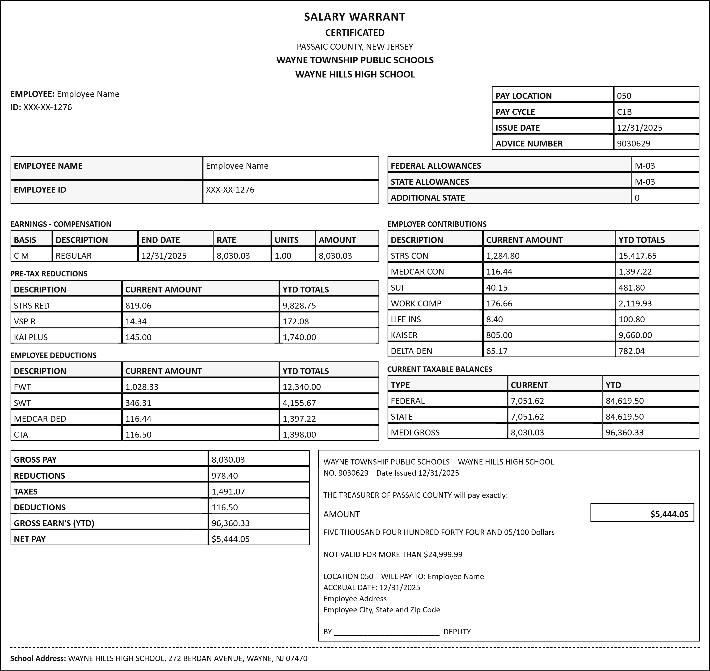

# US K-12 Teacher Pay Stub Generator

A Single Page Application (SPA) designed to simulate realistic pay stubs for US K-12 teachers (modeled after New Jersey standards). The application features a "Smart Logic" engine that automatically calculates taxes, deductions, and year-to-date (YTD) totals based on real-time data.

## 📸 Demo

*Screenshot of the generator interface with a sample paycheck.*

## ✨ Key Features

### 🧠 1. Smart Financial Logic
Instead of generating random numbers, the application uses realistic formulas to calculate financial data:
- **Gross Pay:** Randomized within a realistic teacher salary range ($4,500 - $9,500).
- **Tax & Deductions Engine:**
  - **Federal Tax:** calculated progressively (~11-15%).
  - **State Tax (NJ):** ~3-5%.
  - **Pension (STRS):** Automatically calculates 10.2% of Gross Pay.
  - **Medicare:** Fixed at 1.45%.
- **Net Pay:** Automatically derived from Gross Pay minus all deductions.
- **Number-to-Words:** Automatically converts the Net Pay amount into English text (e.g., *"Four Thousand... Dollars"*).

### 📅 2. Real-Time Date Awareness
The system detects the current real-world date to ensure the pay stub is logically consistent:
- **Auto-Issue Date:** Automatically sets the "Issue Date" to the **last day of the current month** (standard US payroll schedule).
- **Dynamic YTD Calculation:** - If the tool is run in **March**, the Year-to-Date (YTD) column will be exactly **3x** the current month's figures.
  - If run in **December**, the YTD will be **12x** the current figures.
  - This ensures the document is always mathematically valid relative to the current time of year.

### 📷 3. High-Resolution Export
- Integrated with **html2canvas**.
- Exports the pay stub as a **.PNG** image.
- **High DPI:** Automatically scales the output (4x scale) to ensure crisp text and high quality for printing or archiving.

### ✏️ 4. Live Editing
- Fully reactive interface.
- Users can manually override any field (Name, ID, Amounts) and see changes instantly.

## 🚀 How to Use

### Option 1: Run Locally
1. Clone this repository or download the ZIP file.
2. Open `index.html` in any modern web browser (Chrome, Edge, Firefox).
3. Click **"Generate Current Paycheck"** to populate data.
4. Click **"Download Image"** to save the stub.

### Option 2: GitHub Pages
Access the live tool here: https://songmaucodai.github.io/us-teacher-paystub/

## 🛠️ Tech Stack

* **HTML5 / CSS3:** Custom layout designed to mimic thermal paper pay stubs.
* **Vanilla JavaScript:** Handles the DOM manipulation, financial math, and date logic.
* **html2canvas:** Used for rendering the DOM element into an image file.

## 📝 License

This project is licensed under the MIT License - see the [LICENSE](LICENSE) file for details.

---
**Disclaimer:** This tool is intended for educational purposes, UI/UX testing, and data simulation only. It should not be used for fraudulent financial activities or legal misrepresentation.
